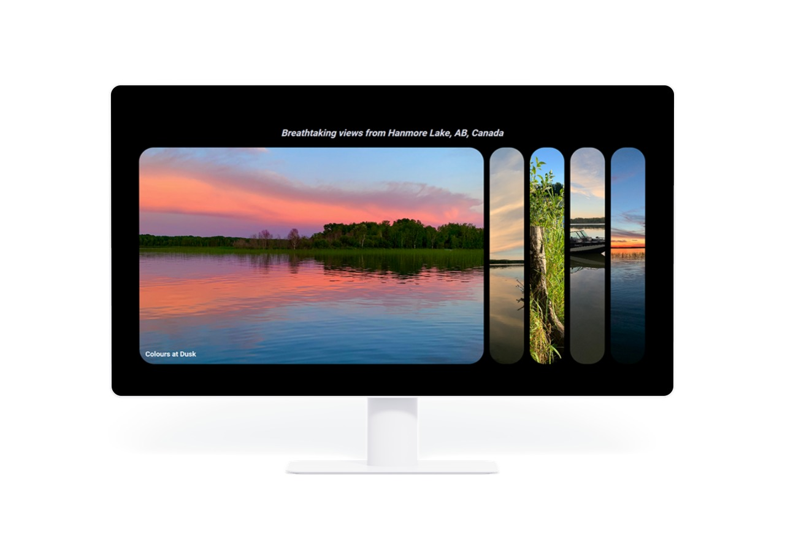

# Hanmore Lake - Photo Gallery

This is a modification to the Expanding Cards project in the [Udemy course 50 Projects in 50 Days](https://www.udemy.com/course/50-projects-50-days/?src=sac&kw=50+projects+50+days). The course helps you improve your coding skills by building realistic mini projects. 

## Project Details

### View My Project: [https://ll-zerr.github.io/hanmore-lake/](https://ll-zerr.github.io/hanmore-lake/)

## Features

- Expanding panels to reveal photo selected
- Responsive design

## Technologies Used

- HTML5
- CSS3
- JavaScript

## Acknowledgements

Project Idea: Brad Traversy, Florin Pop [Udemy course 50 Projects in 50 Days](https://www.udemy.com/course/50-projects-50-days/?src=sac&kw=50+projects+50+days)

Original HTML, CSS & JavaScript provided by: Brad Traversy, Florin Pop [Udemy course 50 Projects in 50 Days](https://www.udemy.com/course/50-projects-50-days/?src=sac&kw=50+projects+50+days)
